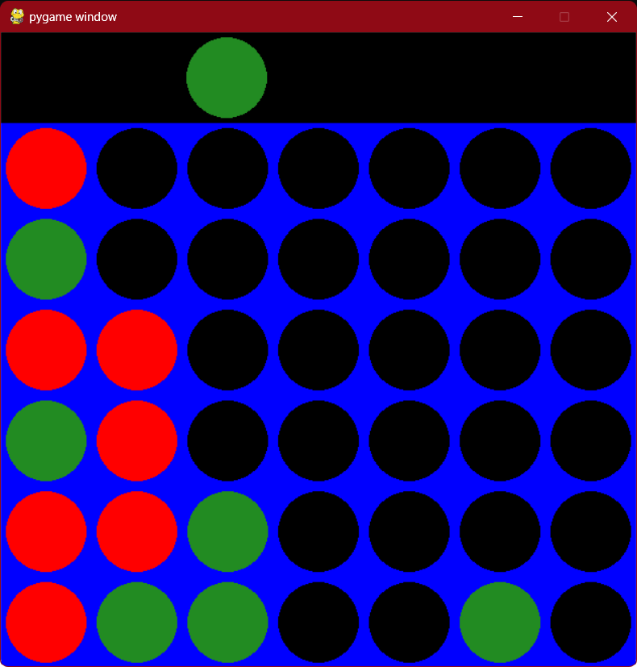

# Connect Four Game with AI

## Project Overview
This project is an interactive Connect Four game where a player competes against an Artificial Intelligence (AI). The game is implemented in Python and features a graphical user interface created with Pygame. Players take turns dropping colored discs into a vertically suspended 6x7 grid, aiming to connect four of their discs vertically, horizontally, or diagonally.

## Key Features
- **Player vs. AI Gameplay:** Engage in a strategic battle against a smart AI that predicts and counters the player's moves.
- **Graphical User Interface:** Utilizes Pygame for dynamic and responsive game visuals.
- **Minimax Algorithm with Alpha-Beta Pruning:** The AI leverages this algorithm to optimize its move selection process, making the game both challenging and engaging.

## Tools Used
- **Python:** The core programming language used for developing game logic and AI computations.
- **Pygame:** A Python library for creating interactive game graphics and handling user inputs.
- **NumPy:** Used for efficient handling of the game board's state and checking for win conditions.

## How to Play
Players use the mouse to choose a column in the grid to drop their disc. The game continues until one player forms a line of four of their discs or the board is filled, resulting in a draw if no player achieves four in a row.

## Game End Conditions
- A player wins by aligning four discs vertically, horizontally, or diagonally.
- The game can also end in a draw if all spaces are filled without any player connecting four discs.

This simple yet engaging game tests strategic thinking and planning, providing a fun challenge against an AI opponent.

